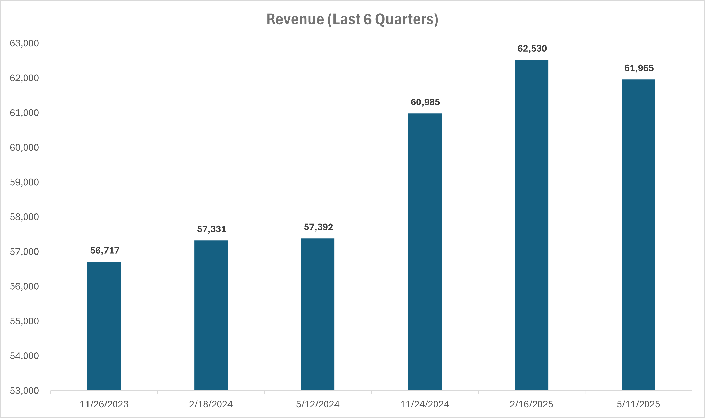
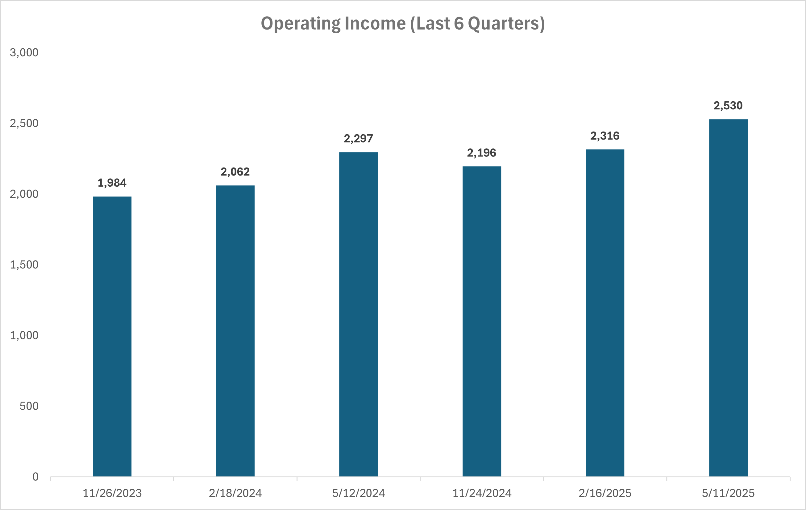
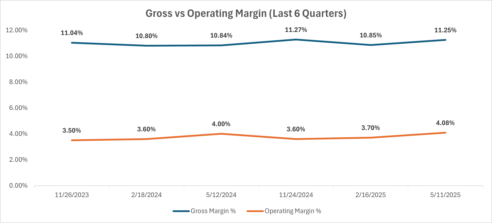
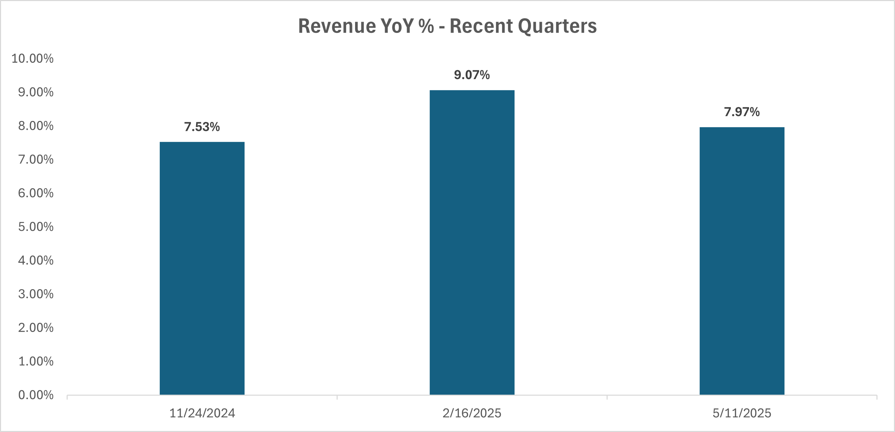

# Costco FP&A Analysis — Historical Performance & Driver-Based Forecast

This project evaluates Costco’s recent financial performance using public SEC filings and builds a driver-based forecast with Base, Upside, and Downside scenarios. The goal is to replicate core FP&A deliverables, income statement snapshot, variance analysis, KPI dashboard, and scenario forecasting — using publicly available data.

---

## Project Objectives
- Build an FP&A-style historical income statement snapshot from SEC filings
- Quantify YoY and QoQ variance in revenue and operating income
- Develop a driver-based forecast using membership and spend assumptions
- Evaluate Base, Upside, and Downside cases with total-year impacts

---

## Selected visuals

  
  

  
  

## Scenario Results (Full-Year Totals)

| Scenario   | Revenue | Operating Income |
|------------|---------|------------------|
| **Base**   | **$318B** | **$11.1B** |
| Upside     | $351B | $14.1B |
| Downside   | $281B | $8.4B |

> The business shows resilient demand with clear upside sensitivity to membership growth and cost leverage, while remaining profitable even under downside conditions.

---

## Repository Structure

/data → Source_Data.xlsx (raw numbers from SEC filing)
/models → Costco_FP&A_Model.xlsx (snapshot, variances, dashboard, forecast)
/docs → Executive_Summary.md (written narrative & assumptions)
/images → Saved charts for use in documentation or slides

---

## Methods & Assumptions (FP&A Style)

Revenue was modeled using explicit business drivers:
Revenue = Membership Growth × Spend per Member

Margins and operating leverage were carried forward from recent reported trends, and scenarios varied only core top-line and margin assumptions.

For full narrative, see:  
`/docs/Executive_Summary.md`

---

## Usage
1. Open `models/Costco_FP&A_Model.xlsx`
2. Review `IS_Snapshot`, `Variance_Analysis`, `Dashboard`, and `Forecast` tabs
3. Adjust assumptions in the Forecast → scenario outputs update automatically

---

## Next Steps (planned enhancements)
- Add cash flow impact and free cash flow bridge
- Add sensitivity tables for renewal rate and margin compression
- Build a companion Power BI dashboard
